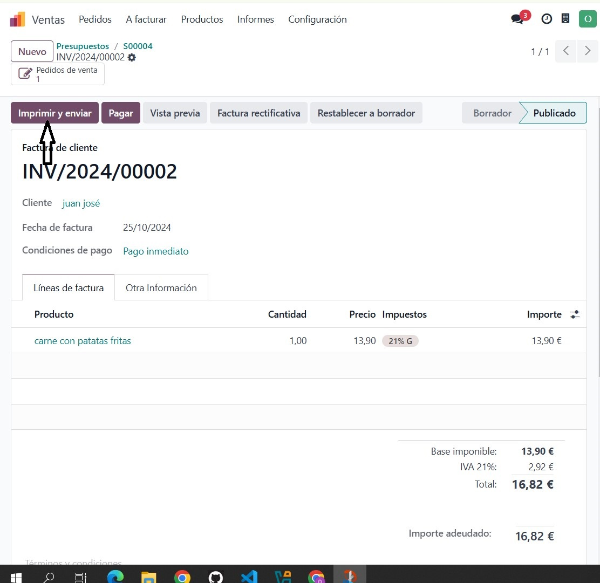

# SGE_B_GRUPA
## Activitat 1 - The bear

## Integrantes del grup:

**Nombres**|**Tareas**
---|---
Kushal Lamichhane | Empleados y Eventos
Omar Mehenni | Ventas y Calendario
Juan Carlos Sanchez | Compras y Costes
Miguel Muñoz Baena | Puntos de venta y Planificación

## Módulos

## Módulo de empleados

### 1. Descripción del módulo
El módulo **Empleados** permite gestionar y administar toda la información relevante del personal en una empresa. Eso incluye gestión de empleados, gestión de departamentos, recultamientos, informes..etc 

### 2. Funcionalidades principales

- **Gestión de Perfiles de Empleados**: Permite crear perfiles detallados con información personal, detalles de contacto, cargo, departamento y personalización de roles.
- **Gestión de Contratos y Puestos**: Permite administración de contratos de trabajo, adaptando el sistema para diferentes tipos de jornada (completa, parcial, por horas), 
- **Organigrama y Jerarquía de Roles**: Permite la creación de un organigrama que muestra la estructura jerárquica del equipo y asignación de roles específicos a cada empleado. 
- **Documentación y Archivos**: Almacena y gestiona documentos importantes asociados al perfil de cada empleado.
- **Historial de Empleados**: Registra cambios importantes de cada empleado, como promociones, movimientos internos, etc.
- **Informes y Análisis**: Genera reportes sobre la plantilla de empleados para análisis y toma de decisiones.

### 3. Ejemplo de uso

### 1. Acceder al Módulo de Empleados
   - Para acceder, abre el módulo de Empleados desde el panel principal de módulos.

   

### 2.Vista principal del módulo
   - Esta es la pantalla principal en la que podrás gestionar los datos de empleados, departamentos, entre otros.

   

### 3. Registación de usuario.
   - Para registrar un nuevo empleado, haz clic en Nuevo y se mostrará un formulario que deberá completar con los datos del empleado.
   - También puede agregar el currículum y las habilidades del empleado.

   

   -En esta plantilla puede generar un ID para la identificación de empleados, junto con un código PIN para cada empleado. Además, también puede gestionar el contrato y los pagos.

   
   

### 4. Gestión de Departamentos
   - Para crear un nuevo departamento o modificar uno existente, puede gestionarlo en el panel de departamentos.

   

### 5. Informes
   - En el panel de Informes, encontrará los informes sobre las cualificaciones y habilidades de cada empleado.

   

### 6. Configuración
   - En el panel de configuración se puede gestionar toda la información sobre:

   - **Plan de actividades.**
   - **Ubicación de trabajo:** desde casa, presencial, semipresencial, remoto etc.
   - **Horarios:** estándar o personalizados.
   - **Motivos de salida:** despedido, renunció, jubilado, etc.
   - **Puesto de trabajo y tipo de empleado.**
   - **Insignias, desafíos, etc.**

   

## Módulo de eventos

## Módulo de ventas

### 1. Descripción del módulo

### 2. Funcionalidades principales

- **Punto q se a explicar**:

### 3. Ejemplo de uso

El módulo **Ventas** de Odoo permite gestionar todas las actividades relacionadas con el proceso de ventas, incluyendo la creación de cotizaciones, la conversión de estas en pedidos, y la generación de facturas. Este módulo es fundamental para el seguimiento de pedidos de clientes, la automatización del proceso de facturación y la organización de los datos de ventas en una única plataforma.

### Pasos para Gestionar una Venta

### 1. Iniciar Sesión y Acceder al Módulo de Ventas
   - Inicia sesión en tu cuenta de Odoo.
   - En el **tablero principal**, haz clic en el módulo **Ventas** para acceder a la página de inicio, donde se muestran las cotizaciones y pedidos existentes.
   
   

### 2. Crear una Nueva Cotización
   - En la página principal del módulo de Ventas, haz clic en **Crear** o **Nuevo** para iniciar una nueva cotización.

   - Se abrirá un formulario en blanco de cotización.

### 3. Agregar los Detalles de la Cotización
   - **Cliente**: Selecciona un cliente en la base de datos o añade uno nuevo haciendo clic en **Crear**.
   
   
   
   - **Productos**: En la sección "Líneas de pedido", agrega los productos o servicios a vender. Especifica la cantidad, el precio y cualquier información adicional.
   
   
   
   - **Fecha de entrega** y **Condiciones de pago** : Completa estos campos para definir los términos de la venta.
    

### 4. Guardar y Enviar la Cotización
   - Haz clic en **Guardar** para registrar la cotización.
   - Para enviarla al cliente, utiliza **Enviar por correo electrónico** o **Imprimir** para obtener una versión impresa.

### 5. Confirmar la Venta
   - Una vez que el cliente acepte la cotización, accede a ella y haz clic en **Confirmar pedido** para convertir la cotización en un **pedido de venta**.
   - Después de la confirmación, la cotización se convierte en un pedido activo listo para ser procesado.

### 6. Generar la Factura (opcional)
   - Si es necesario, crea una factura accediendo al pedido y haciendo clic en **Crear factura**.
   - Completa los detalles de la factura y haz clic en **Validar** para finalizar el registro.
   

Con estos pasos, puedes gestionar fácilmente una venta en el módulo de Ventas de Odoo, desde la creación de una cotización hasta la confirmación de la orden.

### Módulo de calendario-citas

### 1. Descripción del módulo

### 2. Funcionalidades principales

- **Punto q se a explicar**:

### 3. Ejemplo de uso
El **Módulo de Calendario** en Odoo es una herramienta esencial para los restaurantes, ya que permite programar y organizar eventos, reservas y citas con proveedores o personal. Este módulo ayuda a optimizar la gestión del tiempo y asegura que el personal esté bien coordinado para atender a los clientes.

## Pasos para Gestionar el Calendario en un Restaurante

### 1. Acceder al Módulo de Calendario
   
   - Desde el **tablero principal**, haz clic en el módulo **Calendario** para acceder a la vista del calendario donde se pueden visualizar todos los eventos y reservas programadas.

### 2. Crear un Nuevo Evento
   - En la vista de calendario, selecciona la fecha y la hora del nuevo evento. Alternativamente, puedes hacer clic en **Crear** o **Nuevo** para abrir un formulario en blanco.

   - Se abrirá una ventana emergente para agregar los detalles del evento.

### 3. Agregar los Detalles del Evento
   - **Título**: Escribe un título descriptivo para el evento, como “Evento Especial” o “Reunión de Personal”.
   - **Fecha y Hora**: Especifica la fecha y duración del evento.
   - **Descripción**: Incluye detalles relevantes sobre el evento, como el propósito, la agenda y los participantes.
   - **Ubicación**: Define el lugar del evento dentro del restaurante o si es virtual.

### 4. Invitar a Participantes
   - En el formulario del evento, agrega los correos electrónicos de los participantes o selecciona contactos de la base de datos.
   - Al guardar el evento, puedes enviar invitaciones por correo electrónico a todos los asistentes.

### 5. Visualizar y Modificar Eventos
   - Los eventos programados aparecerán en el calendario. Puedes hacer clic en cualquier evento para ver o editar sus detalles.
   - Si se necesita realizar cambios, selecciona el evento y ajusta la información según sea necesario.

### 6. Recordatorios y Notificaciones
   - Configura recordatorios automáticos para eventos importantes. Esto ayuda al personal a estar preparado y asegura que no se olviden citas o reuniones cruciales.

## Módulo de compras

### 1. Descripción del módulo
Gracias al módulo Compras, podemos gestionar las compras realizadas a nuestros proveedores, así como las solicitudes de presupuesto.  
Además, podemos visualizar los pedidos de compra e incluso las facturas de nuestros proveedores.

### 2. Funcionalidades principales
- **Registrar proveedores:** Añadir proveedores y sus datos.
- **Crear solicitudes de presupuesto y pedidos de compra:** Generar solicitudes de presupuesto y pedidos de compra.
- **Recepcionar compras:** Cuando recibamos el pedido de los proveedores, podremos recepcionar la compra y visualizar la factura;  
también podremos ver la solicitud de presupuesto, los pedidos de compra o incluso los albaranes.
- **Añadir nuevos productos:** Podemos dar de alta nuevos productos en nuestro restaurante.
- **Informes de compra:** Podemos visualizar los informes de las compras realizadas.
- **Crear tarifas de proveedor:** Podemos guardar y visualizar las tarifas de los proveedores.
- **Registrar atributos o categorías para los productos:** Tenemos la opción de añadir atributos o categorías a los productos del restaurante rellenando sus datos.

### 3. Ejemplo de uso

 Primero ve al módulo **Compras** y haz clic en instalar; también instala las actualizaciones.
 

**Esta es la pantalla principal en la cual podrás crear solicitudes de presupuesto, pedidos de compra y añadir proveedores.**  
   
 Primero crearemos los proveedores. Para ello, pulsaremos en **Pedidos** y **Proveedores**. 

En la pantalla de proveedores podrás visualizar aquellos proveedores que tienes dados de alta.

 
Una vez pulsado el botón **Crear**, te llevará a la siguiente ventana en la cual solo deberás rellenar los datos de tu proveedor y, al finalizar, pulsar en  
**Guardar** o en **Descartar** si al final no deseas guardar sus datos.  
**(Todas las opciones que permiten crear también permiten descartar dichos cambios por si al final no deseamos crear o guardar).**

Para crear una solicitud de presupuesto, volveremos a la página principal y, esta vez, en vez de pulsar en proveedores, pulsaremos en **Solicitudes de**  
**presupuesto** y en **Crear**. Nos saldrá una ventana como esta, la cual deberemos rellenar con los datos para crear dicho presupuesto.

Aquí tienes un ejemplo de cómo se vería una solicitud de presupuesto una vez creada.

Para crear o dar de alta un nuevo producto en la página principal, pulsaremos **Productos** y en **Crear**. Nos saldrá un recuadro como este,  
donde introduciremos los datos de nuestro producto. (Aquí tienes un ejemplo de un producto llamado fuet; faltaría solo acabar de rellenar sus datos y clicar  
en **Guardar** o en **Descartar** si al final no quieres dar de alta ese producto).

Después de realizar dichas compras, es posible que desees visualizar un informe de ellas. Para ello, pulsa en **Informes**,  
una opción más del menú de la página principal, y visualizarás una ventana como la siguiente en la que te mostrará los informes de dichas compras.  
(En este caso, no hay porque no hay compras realizadas). 

Para visualizar las Tarifas de proveedor hacemos clic en **Configuración** y en **Tarifas de proveedor**; y para crearlas, pulsamos en **Crear**.

Registramos la tarifa de nuestro proveedor completando los datos en un recuadro como el siguiente.

Los atributos y las categorías del producto se visualizan y se crean del mismo modo, cada uno es su pantalla correspondiente.

Después de haber pulsado en **Crear** en la ventana anterior ahora faltaría registrar los datos de los atributos en este recuadro.  
Después pulsaremos en **Guardar** para registrar los cambios o en **Descartar** si no deseáramos al final guardar dichos atributos.  

Podrás visualizar las solicitudes de presupuesto o los pedidos de compra en la página principal.

Clicamos en una solicitud de presupuesto y obtendremos una ventana como la siguiente.  

En esta ventana si clicamos **Imprimir** podremos visualizar e imprimir los pedidos de compra, las solicitudes de presupuesto y si creamos la  
factura también podremos visualizarla y imprimirla.    

Aquí tienes un ejemplo de cómo se vería un pedido de compra.

Este sería otro ejemplo de como se vería la factura.

## Módulo de gastos

## Módulo de puntos de venta

### 1. Descripción del módulo
El módulo **Punto de venta**  és uno de los más importantes para un negocio de restauración. Está diseñado para ofrecer una solución integral para los pedidos, ventas y transacciones que se dan en el dia a dia en el restaruante. Mejorando el servicio al cliente, optimizando el flujo de trabajo y ofreciendo un control completo de la operativa del restaurante. Además, podemos conectar una gran variedad de dispositivos (p ej: bascula, datafono, impresora térmica, etc.) a un PC o tablet que esté conectado a Odoo, pudiendose personlizar y configurar para necesidades especificas. 

### 2. Funcionalidades principales
- **Gestión de mesas y planos del salón**: Permite crear un plano visual personalizado del salón y/o terraza del restaurante. Esto facilita ver qué mesas están ocupadas, libres o en espera, optimizando el flujo de servicio. De este modo, el personal puede asignar pedidos a cada mesa y hacer seguimiento en tiempo real del estado de cada pedido.
- **Toma de pedidos directa en mesa**: Los camareros pueden tomar pedidos directamente en la mesa usando dispositivos como tablets o smartphones, evitando errores y reduciendo el tiempo de espera. Los pedidos se envían automáticamente a la cocina en tiempo real, lo cual agiliza la preparación y evita desplazamientos innecesarios.
- **Gestión de pedidos**: Se pueden agregar o modificar ítems mientras los clientes aún están en la mesa. Admite personalizar los platos según las solicitudes de los clientes (como agregar o quitar ingredientes), y estas instrucciones se envían directamente a la cocina para evitar confusiones.
- **División de cuentas y pagos múltiples**: Facilita dividir la cuenta en caso de que los clientes quieran pagar por separado o dividir la cuenta por plato, por persona, o por cualquier combinación. Es compatible con varios métodos de pago, aceptando efectivo, tarjetas, cuentas o una combinación de diversos en una misma cuenta.
- **Impresiones automáticas en cocina y barra**: El sistema permite configurar impresiones automáticas de pedidos para diferentes zonas (cocina, barra, etc.), de modo que cada área recibe solo los pedidos que le corresponden.
- **Gestión de promociones y descuentos**: Es posible configurar descuentos especiales, menús del día entre semana, menús de fin de semana, promociones 2x1, o cualquier otra oferta temporal. 
- **Control de inventario de ingredientes**: Los ingredientes necesarios para la realización de cada plato pueden estar vinculados con el stock registrado en el **módulo de Inventario** de Odoo. Asegurando el control de existencias y ayudando a evitar el desabastecimiento y facilitar la planificación de compras, especialmente en días de alta demanda.
- **Informes y análisis en tiempo real**: Permite generar informes sobre los platos más vendidos, horas pico, facturación por mesero, y muchos otros datos importantes para el restaurante. Estos análisis permiten ajustar los menús, mejorar el servicio y tomar decisiones basadas en datos sobre la operativa del restaurante.

### 3. Ejemplo de uso

### 1. Acceder al Módulo de punto de venta
   - Desde el menú principal, selecciona el módulo **punto de venta**.

### 2. Iniciar caja del dia
   - Después de hacer clic en el módulo punto de venta, encontrarás un botón **"Abrir caja registradora"**. Haz click en este para empezar una nueva jornada de tabajo.

### 3. Especificar el cambio que tenemos 
   - En la nueva ventana tendremos que poner (1) con cuánto dinero en efectivo empezamos en caja, apretando en (2) podemos especificar qué tipo y cuanta cantidad de billetes y monedas disponemos. Empezamos la (3) sesión apretando al botón "Abrir caja registradora".

### 4. Tomar nota de un pedido
   - Si nos ponemos en la piel de un camarero, en la tablet que lleve puedo ver el mapa del salón y seleccionar la mesa en la que le hacen un pedido, por ejemplo en la mesa 5. Tras esto se abre otra ventana en la que puedo tomar el pedido apuntar que bebida y/o comida le piden.
Cuando seleccione una comida, por ejemplo la hamburguesa de queso, puede personalizar el pedido, añadiendo el tipo de acompañamiento. 

### 5. Editar los pedidos
   - Ahora en la parte izquierda saldrá el pedido y cuanto suma. Podemos realizar diversas acciones (1) como añadir un comentario que haga el cliente, aplicar un sobrecoste (p ej si está en terraza), transferir la cuenta a otra mesa (p ej: el cliente se cambia de mesa), calcular el coste entre varias personas o emitir una factura. También podemos (2) variar la cantidad que solicitan.

### 6. Personificar pedido y envio de peidod a cocina
   - Podemos personalizar (3) que cliente que es (p ej: para aplicar descuentos), especificar (4) una nota para cocina (p ej para que tarden en servir el plato o que no pongan determinados ingredientes), realizar el pedido (5) a cocina.

### 7. Pago y aplicación de descuentos
   - También podemos ir al menú de pago y especificar el modo de pago y aplicar descuentos o recargos (p. ejemplo clientes a los que se ha fiado dinero en el pasado)

### Módulo de planificación

### 1. Descripción del módulo
Este módulo se utiliza para la gestión de horarios y turnos del personal, siendo una herramienta imprescindible para la organización del personal según la previson de demanda. Así, el módulo de **planifiación** te puede ayudar a anticipar necesidades según la afluencia de clientes y optimizar la disponibilidad de personal para asegurar un servicio eficiente.

### 2. Funcionalidades principales

- **Gestión de horarios y turnos**: Permite crear, asignar y gestionar los turnos de trabajo del personal de manera visual, Los empleados pueden ver sus horarios en tiempo real, así como recibir avisos automatizados, reduciendo la posibilidad de malentendidos.
- **Planificación basada en demanda**: Permite ajustar los turnos de trabajo en función de la demanda esperada.
- **Registro de ausencias y permisos**: Los empleados pueden solicitar permisos y registrar ausencias, facilitando la gestión de sustituciones y control de asistencia.
- **Integración con el módulo de Nómina y Recursos Humanos**: la integración con estos dos módulos facilita el calculao de nominas y gestionar otras funciones de personal.
- **Planificación de eventos y reservas especiales**: organizar el pesonal necesario para por ejemplo cumpleaños, bautizos, etc.
- **Informes y análisis de productividad**: puede generar informmes del rendimiento del personal.

### 3. Ejemplo de uso

### 1. Acceder al Módulo de planificación
   - Para acceder, abre el **módulo de planificación** desde el panel principal de módulos.

   

### 2. Crear turnos
   - Desde esta pagina podemos empezar a crear y personalizar los turnos según el personal que tengamos contratado.

   
   
   
   - En *Recurso* añadimos al empleado si ya lo tenemos crado y lo creamos al momento escribiendo el nombre y dándole a crear en la pestaña que aparece debajo. 

   

### 3. Visualización de los turnos
   - Podemos visualizar los turnos asignados de diversas maneras : por ejmeplo según la semana actual, varias semanas, según el mes, etc.

   
   

